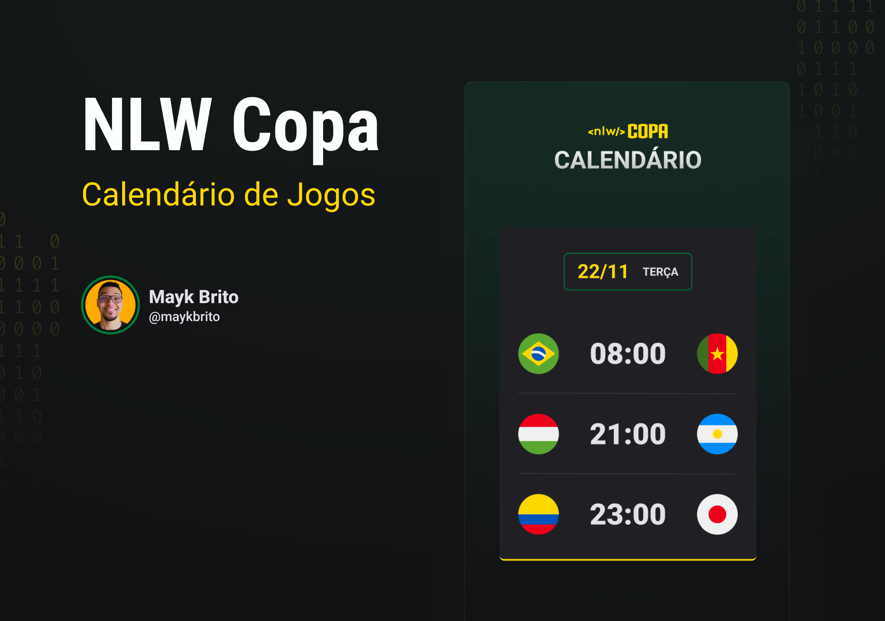

# Calendário Copa

## 💻 Sobre

O Calendário da Copa é um projeto que mostra os jogos da Copa de 2022.

## 🔖 Layout 

Você pode visualizar o layout do projeto no Figma através [DESSE LINK](https://www.figma.com/file/J1Z33MISC22YZB8wfxiIns/NLW-Copa-Explorer/duplicate)). 

## Outros

Esse projeto foi desenvolvido com as seguintes tecnologias:

- HTML e CSS
- JavaScript
- Git e Github